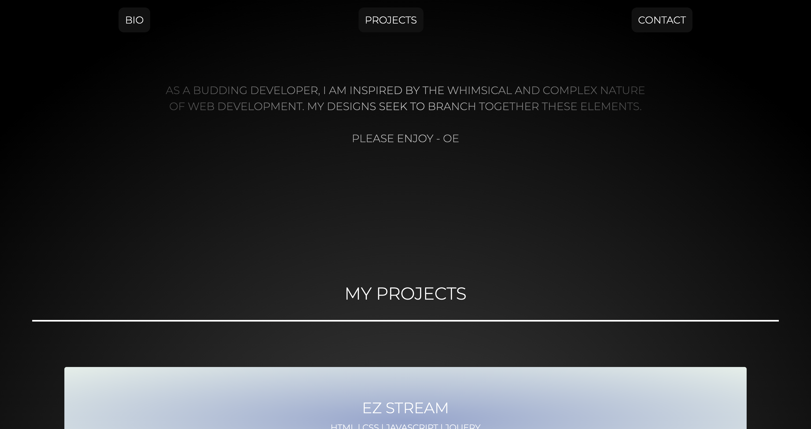

# My portfolio

## Goals

### This project represents my recent work that displays my experience as a web developer.  It is created with format that showcases my understanding of basic Front-End design elements (HTML & CSS) for potential employers to look over.
## Application

#### Highlights
1. The CSS styling is organized and positioned to match the HTML structure 
2. Flex box styling is organized and positioned to highlight my understanding of CSS.
3. The links are tested.
4. `alt` comments were added for greater accessibility.
5. The title is concise and descriptive.
6. Media queries are used to display my web design for different view ports.

## Result

A portfolio that highlights my recent work for a potential employer. 

[Link to the Site](https://olivelliott.github.io/portfolio/)

